# Kiara - Small Language Model (SLM)

An open-source, production-ready implementation of a Small Language Model built from scratch, making AI accessible and transparent for everyone.

> Kiara represents clarity and accessibility in AI development - building language models that anyone can understand, learn from, and contribute to.

## 🚀 Try it Now

**No setup required!** Deploy your own instance on Hugging Face Spaces for free:

- **[Hugging Face Spaces Deployment Guide](documentation/HUGGING_FACE_SPACES.md)** - Free hosting with GPU support

## Quick Start

```bash
# Install
pip install -e .

# Train a small model (2 minutes)
python scripts/train.py --config configs/small.yaml

# Generate text
python scripts/generate.py \
    --checkpoint checkpoints/best_model.pt \
    --prompt "The future of AI"

# Serve via API
python scripts/serve.py --checkpoint checkpoints/best_model.pt
```

**See [Quick Start Guide](documentation/QUICKSTART.md) for detailed setup.**

## Features

- **Zero-Setup Demo**: Try instantly on Hugging Face Spaces
- **Production-Ready**: Docker support, API server, checkpoint management
- **Flexible Configuration**: YAML configs, environment variables, CLI args
- **Comprehensive Testing**: Unit tests with pytest and coverage
- **Modern Tooling**: Black, isort, flake8, mypy, pre-commit hooks
- **Well Documented**: Extensive guides and API documentation
- **Easy Deployment**: Docker Compose, Hugging Face Spaces integration

## Project Structure

```
kiara-slm-project/
├── src/kiara/              # Main package
│   ├── model.py           # GPT architecture
│   ├── training.py        # Training utilities
│   ├── config.py          # Configuration management
│   └── utils/             # Logging, checkpoints, metrics
├── scripts/               # Production scripts
│   ├── train.py          # Training
│   ├── evaluate.py       # Evaluation
│   ├── generate.py       # Text generation
│   └── serve.py          # API server
├── configs/              # Configuration files
├── tests/                # Unit tests
├── documentation/        # All documentation
└── data/                 # Training data
```

## Documentation

### Getting Started
- **[Quick Start Guide](documentation/QUICKSTART.md)** - Get running in 5 minutes
- **[Hugging Face Spaces Deployment](documentation/HUGGING_FACE_SPACES.md)** - Deploy for free with one click
- **[Production Setup](documentation/README_PRODUCTION.md)** - Complete production guide
- **[Tutorial](documentation/TUTORIAL.md)** - Step-by-step learning guide

### Configuration & Usage
- **[Configuration Guide](documentation/CONFIGURATION.md)** - All configuration options
- **[API Documentation](documentation/API.md)** - REST API reference
- **[Technical Documentation](documentation/TECHNICAL_DOCUMENTATION.md)** - Overview of main files and project
- **[Project Structure](documentation/PROJECT_STRUCTURE.md)** - Detailed structure overview

### Migration & Reference
- **[Migration Guide](documentation/MIGRATION_GUIDE.md)** - Upgrade from old structure

## Architecture

### System Overview


### Model Architecture (GPT)

```mermaid
flowchart TB
    TOKENS[Token IDs] --> TE[Token Embedding]
    TOKENS --> PE[Position Embedding]
    TE --> ADD_EMB[Add]
    PE --> ADD_EMB
    ADD_EMB --> LN1[LayerNorm]
    LN1 --> MHA[Multi-Head Attention]
    MHA --> ADD1[Add Residual]
    ADD1 --> LN2[LayerNorm]
    LN2 --> FFN[Feed-Forward]
    FFN --> ADD2[Add Residual]
    ADD2 --> REPEAT["× N Blocks"]
    REPEAT --> LN_FINAL[LayerNorm]
    LN_FINAL --> LM_HEAD[LM Head]
    LM_HEAD --> LOGITS[Logits / Next Token]
```



- **GPT-based Transformer**: Decoder-only architecture with self-attention
- **Multi-Head Attention**: Parallel attention mechanisms for rich representations
- **Positional Encoding**: Learned position embeddings
- **Layer Normalization**: Pre-norm architecture for stable training

## Key Concepts

### Training
- **Next-Token Prediction**: Autoregressive language modeling
- **AdamW Optimizer**: With weight decay and learning rate warmup
- **Mixed Precision**: Faster training with automatic mixed precision
- **Checkpoint Management**: Automatic saving of best models

## Installation

### Standard Installation

```bash
# Create virtual environment
python -m venv .venv
source .venv/bin/activate  # Windows: .venv\Scripts\activate

# Install package
pip install -e .
```

### Development Installation

```bash
# Install with dev dependencies
make install-dev

# Setup pre-commit hooks
pre-commit install
```

### Docker Installation

```bash
# Build image
docker build -t kiara-slm:latest .

# Or use docker-compose
docker-compose up train
```

## Usage Examples

### Training

```bash
# Small model (fast)
python scripts/train.py --config configs/small.yaml

# Default model
python scripts/train.py --config configs/default.yaml

# Resume training
python scripts/train.py --resume checkpoints/checkpoint_epoch5_step1000.pt
```

### Evaluation

```bash
python scripts/evaluate.py \
    --checkpoint checkpoints/best_model.pt \
    --data data/val.txt
```

### Text Generation

```bash
# Greedy decoding
python scripts/generate.py \
    --checkpoint checkpoints/best_model.pt \
    --prompt "Once upon a time" \
    --temperature 0

# Sampling with temperature
python scripts/generate.py \
    --checkpoint checkpoints/best_model.pt \
    --prompt "The future of AI" \
    --temperature 0.8 \
    --top-k 50
```

### API Server

```bash
# Start server
python scripts/serve.py --checkpoint checkpoints/best_model.pt

# Test with curl
curl -X POST "http://localhost:8000/generate" \
    -H "Content-Type: application/json" \
    -d '{"prompt": "Hello", "max_tokens": 50}'
```

## Development

### Running Tests

```bash
# Run all tests
make test

# Run specific test file
pytest tests/test_model.py -v

# With coverage
pytest --cov=src --cov-report=html
```

### Code Quality

```bash
# Format code
make format

# Run linting
make lint

# Type checking
mypy src/
```

## Docker Usage

### Training

```bash
# Using docker-compose
docker-compose up train

# Or directly
docker run --gpus all \
    -v $(pwd)/data:/app/data \
    -v $(pwd)/checkpoints:/app/checkpoints \
    kiara-slm:latest python scripts/train.py
```

### API Server

```bash
# Using docker-compose
docker-compose up api

# Access at http://localhost:8000
```

## Model Configurations

### Small (Fast Training)
- Parameters: ~10M
- Embedding: 256
- Layers: 4
- Heads: 4

### Default (Balanced)
- Parameters: ~100M
- Embedding: 768
- Layers: 12
- Heads: 12

### Large (Best Quality)
- Parameters: ~300M
- Embedding: 1280
- Layers: 36
- Heads: 20

## Configuration

### YAML Configuration

```yaml
model:
  vocab_size: 50257
  context_length: 256
  emb_dim: 768
  n_heads: 12
  n_layers: 12

training:
  learning_rate: 5.0e-4
  batch_size: 8
  num_epochs: 10
```

### Environment Variables

```bash
export MODEL_SIZE=small
export BATCH_SIZE=16
export NUM_EPOCHS=20
```

See [Configuration Guide](documentation/CONFIGURATION.md) for all options.

## Implementation Roadmap

- [x] Project setup and structure
- [x] GPT model architecture
- [x] Self-attention and multi-head attention
- [x] Training loop and data loading
- [x] Text generation (greedy and sampling)
- [x] Checkpoint management
- [x] Configuration system
- [x] REST API server
- [x] Docker support
- [x] Comprehensive testing
- [ ] Fine-tuning support
- [ ] Distributed training
- [ ] Model quantization
- [ ] ONNX export

## Contributing

We welcome contributions! Kiara is built on the belief that open collaboration makes better AI.

**Repository access:** This repository is protected. Only authorized maintainers can push directly to the default branch. Everyone can read, fork, and open pull requests. See [CONTRIBUTING.md](CONTRIBUTING.md) for how to contribute.

**Ways to contribute:**
- Code contributions (bug fixes, features, improvements)
- Documentation improvements
- Bug reports and feature requests
- Community support

## Resources

- **Book**: "Build a Large Language Model (From Scratch)" by Sebastian Raschka
- **GitHub**: https://github.com/rasbt/LLMs-from-scratch
- **PyTorch Docs**: https://pytorch.org/docs/

## Support This Project

- **Star this repository** - Help others discover Kiara
- **Contribute code** - Your expertise makes Kiara better
- **Share with others** - Spread the word about open-source AI

### Sponsor

Your sponsorship helps maintain Kiara, add features, and keep AI education accessible to everyone.

<p align="center">
  <a href="https://github.com/sponsors/nexageapps" title="Sponsor Kiara on GitHub">
    
  </a>
</p>

**[→ Sponsor on GitHub](https://github.com/sponsors/nexageapps)**

## License

MIT License - Free to use, modify, and distribute.

Kiara is proudly open source. We believe AI education and tools should be accessible to everyone.

---

**Built by the open-source community**
